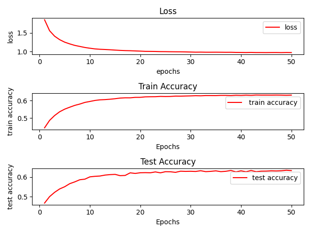
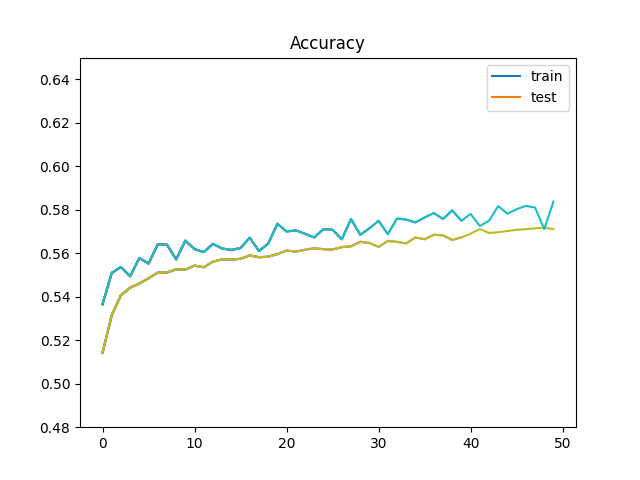

# nlp-beginner-impl

[TOC]

---

## Lab 1

An MLP for text classification implementation from scratch only by `numpy` is required in Lab 1

training plot:

## Lab 2

A Pytorch version of Lab 1 with CNN and RNN classifier is required in Lab 2, whose initialization shall be random or by pre-trained GLoVe vectors. 

train plot

---

## Lab 3

---

## Lab 4

---

## Lab 5
