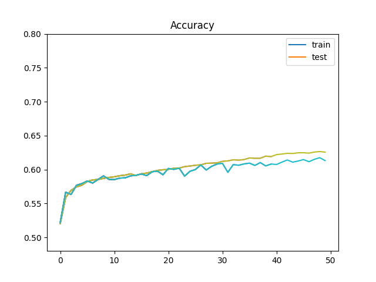
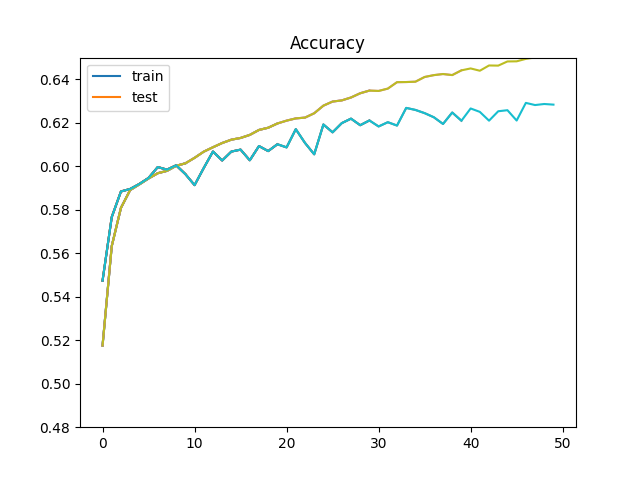
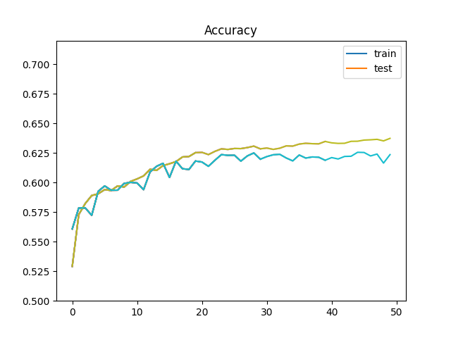
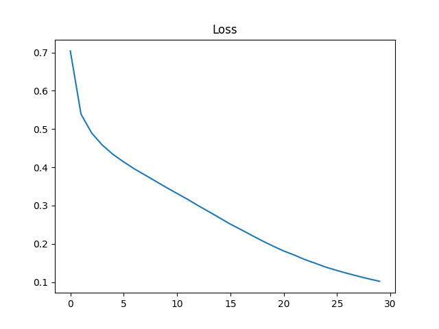
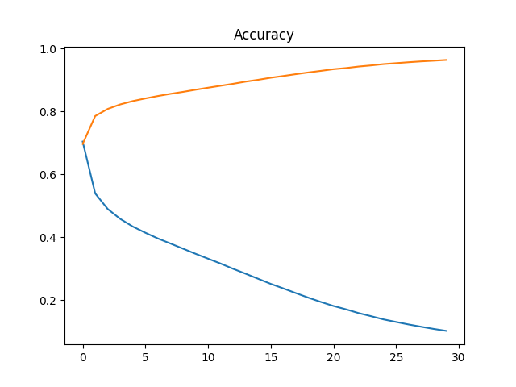
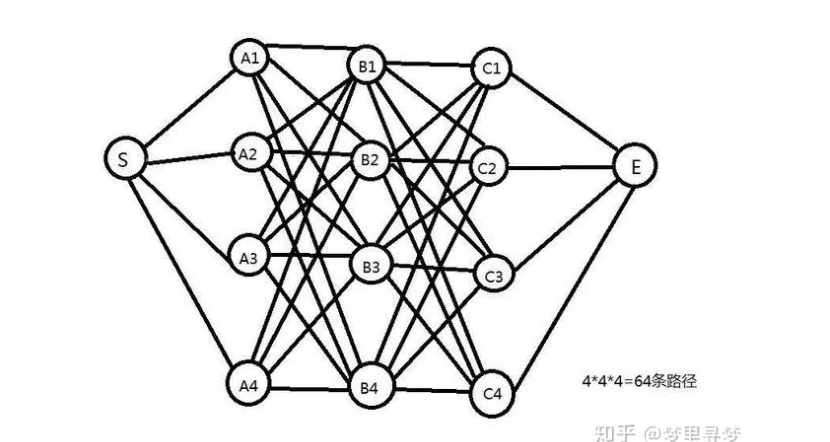
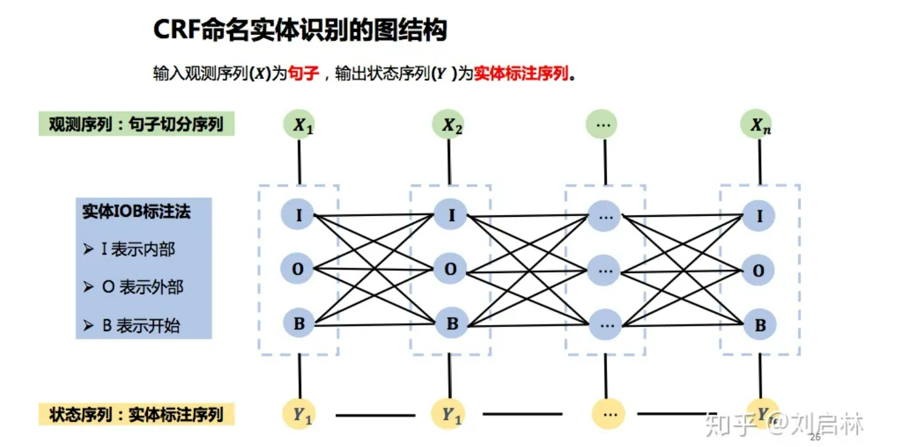
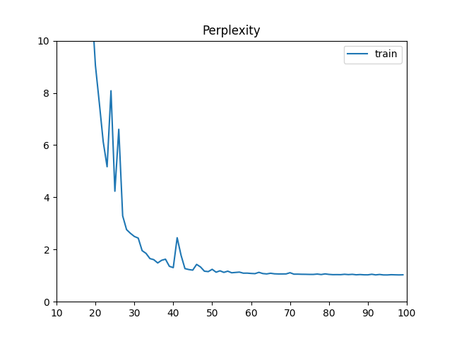
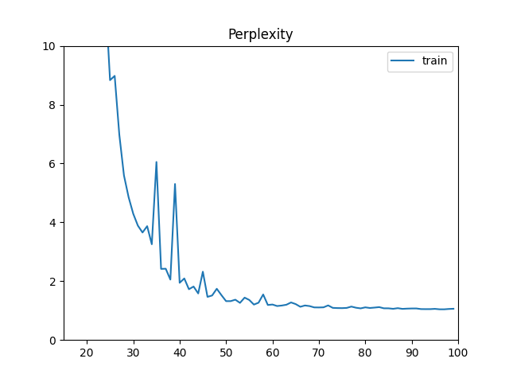

# nlp-beginner-impl

This is a possible implementation of https://github.com/FudanNLP/nlp-beginner

[TOC]

---

## Lab 1

*test accuracy here actually means validation accuracy*

An MLP for text classification implementation from scratch only by NumPy is required in Lab 1

training plot:


*The accuracy on the corresponding [Kaggle comepetition](https://www.kaggle.com/competitions/sentiment-analysis-on-movie-reviews) is bad, just 19%*

--- 

## Lab 2

A Pytorch version of Lab 1 with CNN and RNN classifier is required in Lab 2, whose initialization shall be random or by pre-trained GLoVe vectors. Here are some results

*test accuracy here actually means validation accuracy*

*epoch for all experiments is 50*

**CNN train plot**

- TextCNN([paper](https://arxiv.org/abs/1408.5882)) with GLoVe 50d

*learning rate 0.001*

*dropout 0.5*

*batch size 128*

*weight decay 0.001*


The best performance on the same competition in Lab 1 reached 58.3%

**RNN training plots**

1. GRU with GLoVe 50d

*learning rate 0.001*

*batch size 64*

*weight decay 1e-5*



The best performance on the same competition in Lab 1 reached 60.3%

2. LSTM with GLoVe 100d

*learning rate 0.001*

*batch size 64*

*weight decay 1e-5*


but the best performance is 59.2%, a little bit worse than GRU

Further experiments are needed to find out whether this is because of the change of NN structur or the dimension of word vector

3. GRU with GLoVe 100d

*learning rate 0.001*

*batch size 64*

*weight decay 1e-5*



The best performance on the same competition in Lab 1 reached 61.3%

*By comparing experiment 2 and 3, it can be concluded that it is the structure of the network that influences the result.*

*A possible reason for this is the parameters in the hidden layer of LSTM(a tuple of 2 tensors) is more than that in GRU(1 tensor). So it is prone to overfit.*

4. Bi-GRU with GLoVe 100d

*learning rate 0.001*

*batch size 64*

*weight decay 1e-4*



The best performance on the same competition in Lab 1 is 60.7%

*I do not know why Bi-GRU or Bi-LSTM won't improve performance. Maybe there is better hyper-parameter combinations.*

*Besides I also tried gradient clipping but it will do bad to this lab because the amount of training data is not large(at $10^5$ level). Gradient boom won't appear.*

*This is the end of lab 1 & 2*

---

## Lab 3

This is an implementation of the ESIM model of [this paper](https://arxiv.org/abs/1609.06038)

Hyper parameters:

```py
batch_size = 256
embed_size = 100
sentence_length = 50
hidden_size_lstm = 128
hidden_size_dense = 128
lr = 4e-4
epoch = 20
dropout = 0.5
```

I trained the model 30 epochs using SNLI dataset. But when tested, it seems 10 epochs is enough, more epochs could cause overfit. 

The loss curve:



The accuracy & loss curve:



Test accuracies:

| Epoch                   | Acc     |
|:-----------------------:|:-------:|
| 0(Randomly initialized) | 32.88 % |
| 10                      | 85.50 % |
| 20                      | 83.69 % |
| 30                      | 83.16 % |

Customized test is available in `prediction.py`, You can play with this.

*Concatenating information produced by LSTM is useful. Attention is strong*

*This is the end of lab 3*

---

## Lab 4

**A note for viterbi algorithm & CRF**

1. *Viterbi algorithm*<sup>[1]</sup>

This is actually an *abstract* method for all **"shortest"-path problems** of *layered & structured* graph.

The algorithm uses DP to find the 'shortest' path from the start to the end.

consider this graph:



If we want to get the shortest path length from S to E, we need to:

- calculate **all** the distances from S to layer A

- calculate and reserve the **shortest** paths and their start points(the precedent array) from layer A to layer B (i.e A->B{1,2,3,4}) **Just 4 paths reserved, which accelerates the algorithm compared with brute-force**

- repeat the step from layer B to C

- choose the shortest path from layer C to E

- backtrack according to the precedent array to S, record every point

- the reversion of the record in the previous step is the shortest path from S to E

These are basic steps of viterbi algorithm

All models using this algorithm just differs on the definition of **path length**

2. *CRF*<sup>[2]</sup>
- Undirected Graph Model(General CRF)

It models a joint distribution of multi-dimensional variants as the production of a series    of **maximum clique**:

$$
p(\mathbf x,\mathbf y) = \frac{1}{Z}\prod_a \mathbf{\Psi}_a(\mathbf x_a,\mathbf y_a) 
$$

where:

$Z=\sum_{\mathbf x,\mathbf y}\prod_a \mathbf \Psi_a(\mathbf x_a,\mathbf y_a)$ : normalization function

$\mathbf \Psi_a$: the $a_{th}$ factor node function

In ML $\mathbf \Psi_a$ is usually an exponential function:

$$
\mathbf \Psi_a = \exp{\sum_kw_{ak}f_{ak}(\mathbf x_a,\mathbf y_a)}
$$

For a discriminative model, $Z(\mathbf x) = \sum_{\mathbf y}\prod_a \mathbf \Psi_a(\mathbf x_a,\mathbf y_a)$ for every $\mathbf x$

and:

$$
p(\mathbf y|\mathbf x) = \frac{1}{Z(\mathbf x)}\prod_a \mathbf{\Psi}_a(\mathbf x_a,\mathbf y_a) 
$$

is the general form of CRF.

- Linear Chain CRF (CRF in sequence tagging)

When applied to sequence tagging, CRF is specialized to Linear Chain CRF, which is able to handle multiple features with each feature has a factor connected to the hidden state and neighbouring states are also connected by factors.

factors using $\mathbf x_t$ and $y_t$ are called **state features (alike emit matrix in HMM)** and factors using $y_t$ and $\ y_{t-1}$ are called **transition features(alike transition matrix in HMM)**

The definition of Linear Chain CRF is (vectorized):

$$
p(\mathbf y|\mathbf x) = \frac{1}{Z(\mathbf x)}\exp(\sum_{t=1}^T\mathbf w\cdot\phi(y_{t-1},y_t,\mathbf x_t))
$$

where:

$\mathbf w$: weights of each features

$\phi$: features

It is like the feature and score functions in SP(Structured Perceptron)

3. *Viterbi algorithm in CRF*<sup>[2] [3]</sup>

Essentially, the layers in part 1 are instantialized as **all the possible states** in HMM, Structured Perceptron and CRF as shown below:



We just need to calculate the **maximum** path length of the graph with a customized *score function*

[1] https://zhuanlan.zhihu.com/p/40208596

[2] Introduction to Natrual Language Processing, Chapters 5 and 6, Han He, 2019

[3] https://zhuanlan.zhihu.com/p/148813079

**Implementation log**


---

## Lab 5

1. 花丛狭路尘
   间黯将暮云
   间月色明如
   素鸳鸯池上
   两两飞凤凰
   楼下双双度
   物色正如此
   佳期那不顾

2. 明月夜玉殿莓苔
   青宫女晚知曙祠
   官朝见星空梁簇
   画戟阴井敲铜瓶
   中使日夜继惟王
   心不宁岂徒恤备
   享尚谓求无形孝
   理敦国政神凝推

*hyper-parameters*

`batch_size = 64`

`num_steps = 10 or 14`

`embedding_size = 100`

`hidden_size = 256`

`lr = 0.001`

There are poems generated by the GRU model. Somehow nonsense.(Copying the dataset)

I tried the time steps of 10(for 5-charactered-sentence poem) and 14(for 7-charactered-sentence poem)

The perplexity of time step 10:



The perplexity of time step 14:



*I think it is better to use seq2seq. I will try if time allows.*

*This is the end of lab 5*
