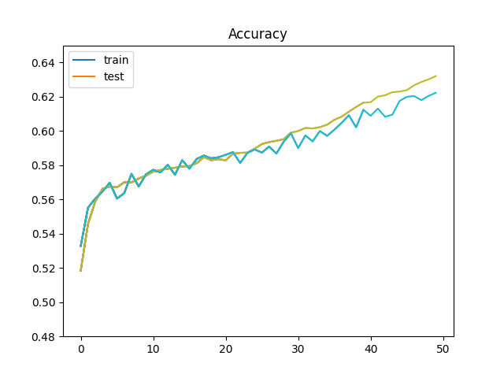

# nlp-beginner-impl

[TOC]

---

## Lab 1

*test accuracy here actually means validation accuracy*

An MLP for text classification implementation from scratch only by NumPy is required in Lab 1

training plot:

The accuracy on the corresponding [Kaggle comepetition](https://www.kaggle.com/competitions/sentiment-analysis-on-movie-reviews) is bad, just 19%

--- 

## Lab 2

*test accuracy here actually means validation accuracy*

A Pytorch version of Lab 1 with CNN and RNN classifier is required in Lab 2, whose initialization shall be random or by pre-trained GLoVe vectors. 

**CNN train plot**

- TextCNN([paper](https://arxiv.org/abs/1408.5882)) with GLoVe 50d

learning rate 0.001

dropout 0.5

batch size 128

weight decay 0.001

The best performance on the same competition in Lab 1 reached 58.3%

**RNN training plots**

- GRU with GLoVe 50d

learning rate 0.001

dropout 0.5

batch size 64

weight decay 1e-5

The best performance on the same competition in Lab 1 reached 60.3%

- LSTM with GLoVe 50d

- LSTM with GLoVe 100d

learning rate 0.001

dropout 0.5

batch size 64

weight decay 1e-5

but the best performance is 59.2%, a little bit worse than GRU

Further experiments are needed to find out whether this is because of the change of NN structur or the dimension of word vector 

- Bi-xxx with GLoVe xxx

## Lab 3

---

## Lab 4

---

## Lab 5
